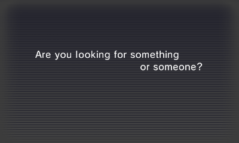
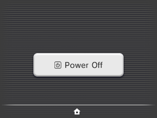
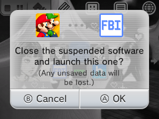
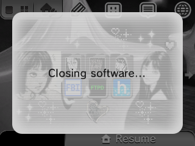
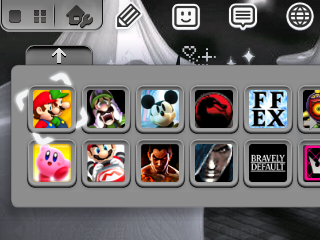

# 3DS Custom Home Menu  
Check out the [Codeberg](https://3ds.codeberg.page/homemenu/)'s Home Menu Customisation Guide to create your own custom Home Menu for 3DS!  

## Parazzini's Custom Home Menu
My custom Home Menu for the Nintendo 3DS  

  
  
  
  
  

## Table of Contents

  
Click to expand menu

  
- [Notes](#notes)
- [What is edited?](#what-is-edited)
- [Installation guide](#installation-guide)  
  - [Prerequisites](#prerequisites)
  - [How to install](#how-to-install)
- [Additional features](#additional-features)
- [How to uninstall](#how-to-uninstall)
- [Extra content](#extra-content)
- [Credits](#credits-go-to)

## Notes
- Support
   - Old/New 3DS/2DS
   - EUR/USA/JPN latest version `11.17.0-50`

## What is edited?
- Spinning cursor animation
- Custom animations:  opening folders, sleep mode screen, opening/closing software and dialog windows
- Added windows transparency
- Changed sleep screen, with a big button in the middle and custom text
- Custom icons
- Custom launcher: moved the resize apps indicator to the left
- Clock HUD moved to the top center of the top screen
- Removed Y and L + R indicators on top screen 
- Removed arrows background
- Removed the connection bar and its texts (Internet, StreetPass, etc.), leaving only the signal indicator
- Removed play coins count and steps count 
- Removed the Miiverse applet icon adding skip functionality (optional)
- White cursor
- Grey HUD (battery indicator icon, clock, connection and signal indicator icon)
- Grey applet icons
- Grey shutdown screen
- Grey scroll indicator

## Installation guide  
> This mod is installed with LayeredFS, a Luma3DS feature that displays the files from the SD card instead of your console, you can remove it at any time without issues
### Prerequisites
- For this mod Luma3DS custom firmware `10.3` or above is required - [install/upgrade it here](https://github.com/LumaTeam/Luma3DS)
- Make sure to have game patching enabled in your Luma config:
   - Boot the console while holding the SELECT button to launch Luma3DS configuration
   - Select (x) "Enable game patching"
   - Save and exit pressing START  

### How to install
1. Download the preferred archive version in the [releases page](https://github.com/parazzini/Custom-Homemenu-3DS/releases) and uncompress it
2. Choose your console region and copy/paste the `luma` folder in the root of your SD card

## Additional features
- Theme (contains some Home Menu elements and the cursor color): copy/paste the `Themes` folder in the root of your SD card and install it with Anemone3DS - [tutorial](https://3ds.eiphax.tech/themes)
- Badges: copy/paste the `badges` folder in the root of your SD card and install them with GYTB - [tutorial](https://wiki.hacks.guide/wiki/3DS:GYTB)

## How to uninstall
1. Boot the console while holding the START button to launch GodMode9
2. Go to `SDCARD:/luma/titles`
3. Delete the folder based on your region:
   - EUR: `0004003000009802`
   - JPN: `0004003000008202`
   - USA: `0004003000008F02`

## Extra content
### Home Menu Mods made by other people
- [3DS Battery Patches by R-YaTian](https://github.com/R-YaTian/3ds-battery-patches) - Show the battery percentage in the status bar and display each bar as 25% of battery charge
- [Kitsune's Spinning Cursor](https://www.youtube.com/watch?v=jSDKwLYfmHg)

## Credits go to:
- [Kitsune’s Custom Home Menu](https://aromakitsune.github.io/3DS-Custom-Home-Menu-UI)
- [Coolgamer's Custom Home Menu](https://github.com/cooolgamer/Custom-Homemenu-3DS)
- [fwdrxyyìs's_ Theme](https://themeplaza.art/item/99258)
- [Eboi47_](https://themeplaza.art/item/85956), [Jushua](https://themeplaza.art/item/61176), [ennchanted](https://themeplaza.art/item/97917), [litkud](https://themeplaza.art/item/88211), [ditadelrey](https://themeplaza.art/item/96632), [ch3m1cal_](https://themeplaza.art/item/92355) badges
